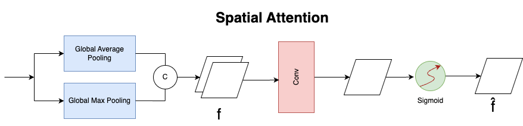
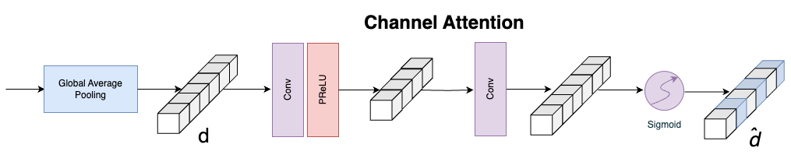
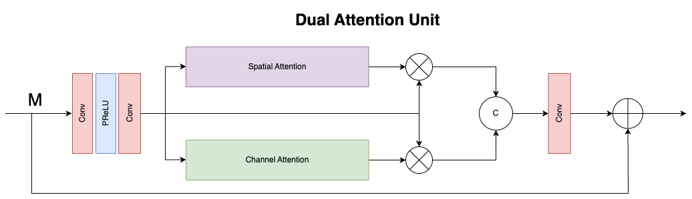
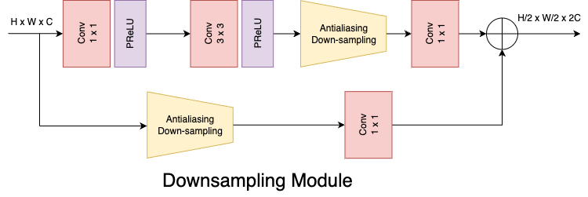

# Low-Light Image Enhancement Using MIRNet

This repository implements low-light image enhancement using the MIRNet (Multi-scale Input Restoration Network) deep learning model. MIRNet is a cutting-edge neural network designed to improve dark images while preserving important details and minimizing noise.

## Table of Contents

 - [Introduction](#introduction)
 - [Dataset](#dataset)
 - [Installation](#installation)
 - [Dual Attention Module](#dual-attention-module)
 - [License](#license)

## Introduction

Image restoration is essential in fields like photography, security, medical imaging, and remote sensing, aiming to recover high-quality content from degraded images.
The MIRNet architecture is fully convolutional and captures multi-scale contextual features, allowing it to enhance low-light images while maintaining high-resolution spatial details.

## Dataset

This project uses the LoL (Low-Light) Dataset, which contains:

Training: 485 low-light/well-exposed image pairs

Testing: 15 image pairs

Each pair consists of a low-light input image and its corresponding well-lit reference image.
You can download the dataset from [here](https://www.kaggle.com/datasets/arnabkumarroy02/lol-dataset/data).

## Installation

To run this project:

Clone this repository:https://github.com/chandan7021/LoL-Image-Enhancement.git
## Dual Attention Module

The Dual Attention Unit (DAU) is used to enhance feature extraction in convolutional layers. While the SKFF block merges multi-resolution information, the DAU ensures that only the most informative features pass through. This is achieved via:

Channel Attention: Focuses on the most relevant feature channels

Spatial Attention: Highlights important spatial regions

This mechanism recalibrates features, suppressing less useful ones and enhancing the important signals.

  
  
Fig: Spatial Attention from Dual Attention Unit

   

  
  
Fig: Channel Attention from Dual Attention Unit

   

	
	
Fig: Dual Attention Module

	 

Downsampling Module            |  Upsampling Module
:-------------------------:|:-------------------------:
  |  

This project is licensed under the MIT License. See the [LICENSE](LICENSE) file for more details.
